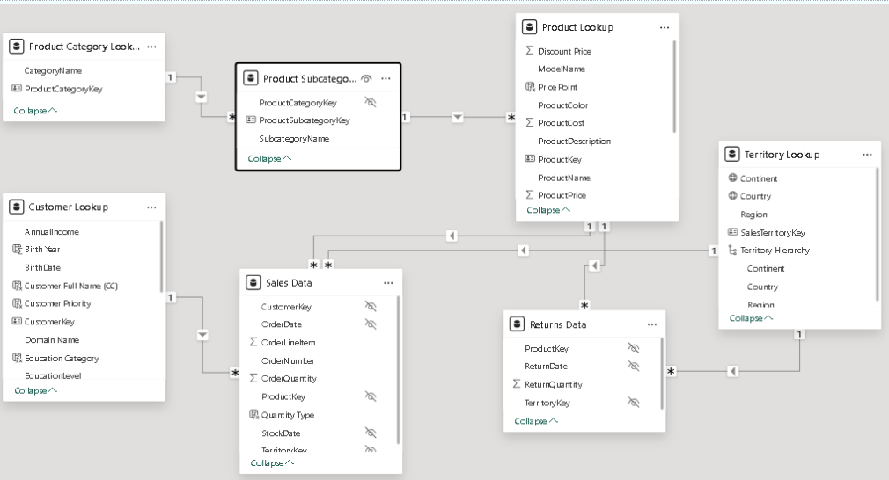

# 📊 Data Exploration

### 📁 Data Files Available  
- **Sales Tables:** 2020, 2021, 2022  
- **Returns:** Returned products  
- **Customers**  
- **Products**  
- **Product Categories & Subcategories**  
- **Territories**

---

### 🔍 Initial Observations  

- **Sales 2020:**  
  - 8 columns, 2,630 records  
  - Contains Product, Customer, Territory data  

- **Sales 2021:**  
  - 8 columns, 23,935 records  

- **Sales 2022:**  
  - 8 columns, 29,481 records  

**📝 Comment:**  
Sales increased significantly. 2020 has ~10x fewer records than 2021–2022, suggesting sales or data collection may have begun in 2020.

- **Returns:**  
  - 4 columns, 1,809 records  

- **Territories:**  
  - 4 columns, 10 records  
  - Covers 5 US regions, Canada & 4 European countries  

- **Product Categories:**  
  - 2 columns, 4 records  

- **Product Subcategories:**  
  - 3 columns, 37 records  

- **Products:**  
  - 11 columns, 293 records  
  - Includes: Product Name, Model Name, Description, Colour, Size, Style, **Cost**, **Price**  
  - 💡 *Margin can be calculated.*

- **Customers:**  
  - 13 columns, 18,148 records  
  - Includes: Name, Birthday, Email, Gender, Marital Status, Income, Education, Profession, Home Ownership  
  - 💡 *Customer trends can be analyzed.*

---

### 🧬 Unique Values & Primary Keys  
Checked for unique values in potential primary key columns across tables to validate integrity and relationships.

---

### 🔗 Setting Relationships Between Tables  

| Table             | Primary Key                                               | Foreign Keys                          |
|------------------|-----------------------------------------------------------|---------------------------------------|
| Sales 2020       | `OrderNumber`                                             | `ProductKey`, `CustomerKey`, `TerritoryKey` |
| Sales 2021 & 2022| `OrderNumber`                                             | `ProductKey`, `CustomerKey`, `TerritoryKey` |
| Returns          | `ReturnDate` + `ProductKey` + `TerritoryKey` (composite) | `ProductKey`, `TerritoryKey`          |
| Products         | `ProductKey`                                              | `ProductSubcategoryKey`               |
| Product Subcategories | `ProductSubcategoryKey`                              | `ProductCategoryKey`                  |
| Product Categories | `ProductCategoryKey`                                    | –                                     |
| Territories      | `SalesTerritoryKey`                                       | –                                     |
| Customers        | `CustomerKey`                                             | –                                     |

---

### 🧭 From Power BI  
*Relationship diagram created in Power BI using primary and foreign keys.*  

