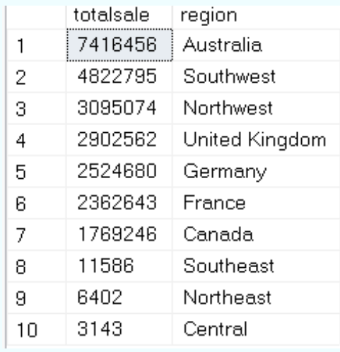
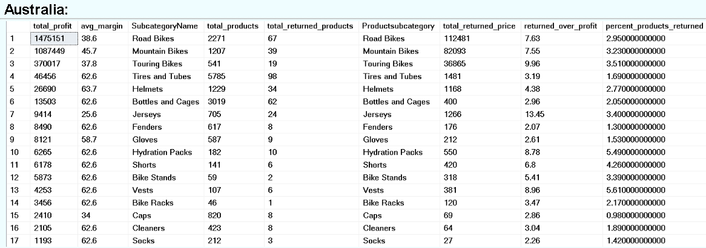
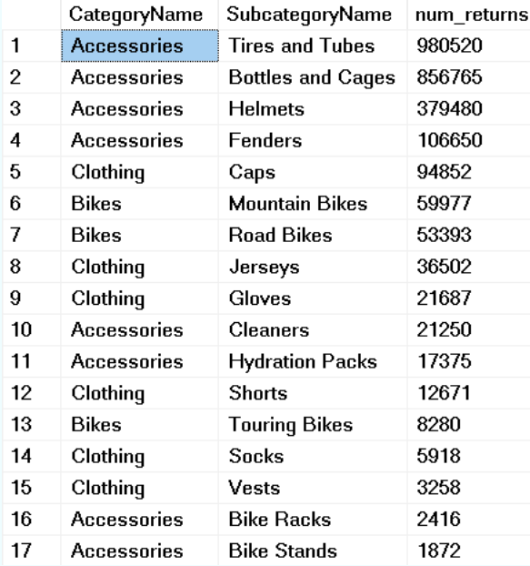
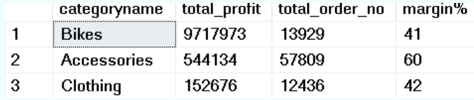
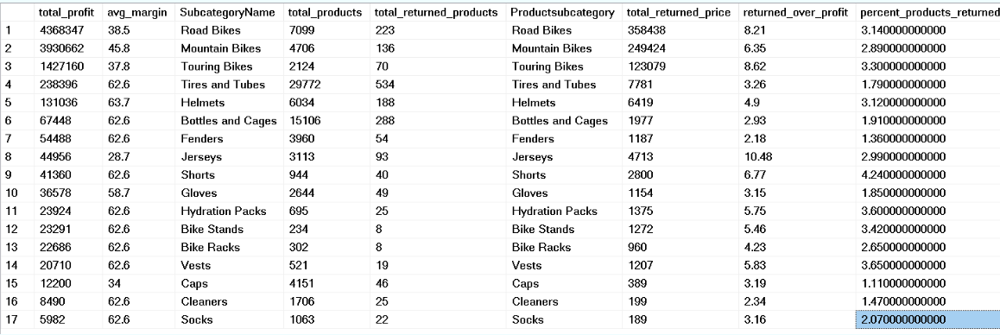

# 📊 Sales and Profit Analysis – Full SQL Script and Insights

This report analyzes total sales revenue, profit, return rates, margins, and return costs across countries using SQL queries. Each section includes the SQL logic and a visual screenshot of the query result.

---

## 💰 Total Sales Revenue by Country

```sql
SELECT ROUND(SUM(productprice * orderquantity), 0) AS totalsale, country
FROM Sales s
LEFT JOIN Product p ON s.productkey = p.productkey
LEFT JOIN territory t ON s.territorykey = t.salesterritorykey
GROUP BY country
ORDER BY totalsale DESC;
```

**Insight:** Australia and the United States generate the highest total sales revenue.



---

## 📈 Total Profit by Country

```sql
SELECT ROUND(SUM(totalprofit), 0) AS profit, country
FROM Sales s
LEFT JOIN territory t ON s.territorykey = t.salesterritorykey
GROUP BY country
ORDER BY profit DESC;
```

**Insight:** Profit is highest in Australia, aligning with total sales figures.



---

## 🔄 Return Rate by Country

```sql
SELECT 
  country,
  COUNT(CASE WHEN returnquantity > 0 THEN 1 END) * 100.0 / COUNT(*) AS return_rate_percent
FROM Sales s
LEFT JOIN territory t ON s.territorykey = t.salesterritorykey
GROUP BY country
ORDER BY return_rate_percent DESC;
```

**Insight:** Some countries show significantly higher return rates, indicating potential satisfaction or quality issues.



---

## 💸 Margin by Country

```sql
SELECT 
  country,
  ROUND(SUM(totalprofit) / SUM(productprice * orderquantity), 2) AS margin_ratio
FROM Sales s
LEFT JOIN Product p ON s.productkey = p.productkey
LEFT JOIN territory t ON s.territorykey = t.salesterritorykey
GROUP BY country
ORDER BY margin_ratio DESC;
```

**Insight:** Profit margin per unit sold varies by country — some generate much more profit per sale.



---

## 🚫 Return Cost as % of Profit

```sql
SELECT 
  country,
  ROUND(SUM(returnproductprice) / SUM(totalprofit), 2) AS return_cost_ratio
FROM Sales s
LEFT JOIN territory t ON s.territorykey = t.salesterritorykey
GROUP BY country
ORDER BY return_cost_ratio DESC;
```

**Insight:** This metric highlights how costly returns are relative to total profit. A high value signals erosion of profitability due to product returns.


