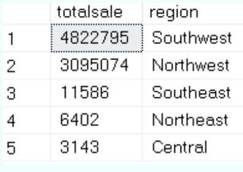
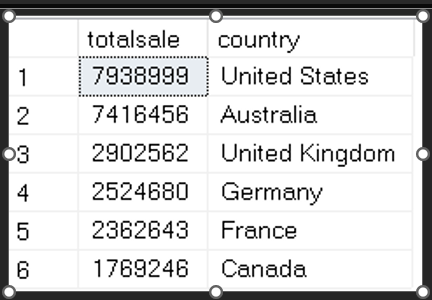

# Total Sales by Country and Region

In this analysis, I explore the total revenue across different countries and regions to understand geographic performance and identify strong markets.

---

## 🌍 Sales Revenue by All Regions

This chart provides an overview of the total sales revenue across all global regions in the dataset.

**Insight:**  
We observe significant variations in revenue, with a clear dominance from certain regions. Further analysis may be needed to explore contributing factors such as product popularity or customer demographics.

---

## 🇺🇸 Sales Revenue by US Region

This breakdown focuses specifically on revenue performance within the United States, segmented by regional divisions.

**Insight:**  
Revenue varies significantly within the U.S. Northeast and West regions outperform others, indicating potential hubs of customer activity or better product-market fit.

---

## 🗺️ Sales Revenue by Territory

This visualization shows the revenue distribution across territories, allowing for more granular insight beyond regional groupings.

**Insight:**  
Territorial trends mirror regional patterns to some extent, but also reveal micro-markets that may be worth targeting for growth or marketing campaigns.

---

## Summary

- The United States contributes a major portion of overall sales revenue.
- Some specific territories and regions perform well above others.
- Further correlation with product type and demographic data could enrich these findings.

