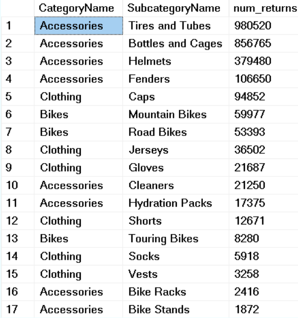
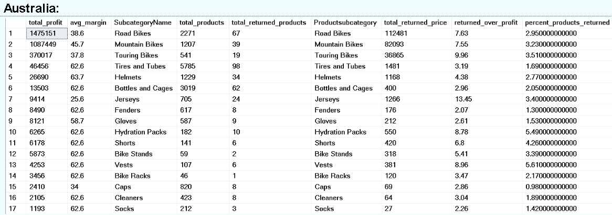

# 📦 Returns Analysis

### 🎯 Aims  
Analyze which categories and subcategories have the most returns, how returns have evolved over time, and how they affect profitability—overall and by country.

---

## 🔄 Returns by Category & Subcategory  

**SQL:**  
SELECT  
  CategoryName,   
  SubcategoryName,   
  SUM(CAST(ReturnQuantity AS INT)) AS num_returns   
FROM Returns r  
LEFT JOIN sales_analysis sa ON sa.Product_ProductKey = r.ProductKey  
GROUP BY CategoryName, SubcategoryName  
ORDER BY num_returns DESC;

**Insight:**  
Four accessories subcategories have the most returns: **Tires and Tubes**, **Bottles and Cages**, **Helmets**, and **Fenders**.  
High-value subcategories like **bikes** are returned less often.

---

## 📅 Returns Over Time  

**SQL:**  
SELECT  
  ROUND(SUM(ProductPrice * ReturnQuantity), 0) AS total_product_cost,  
  YearMonth  
FROM Returns  
GROUP BY YearMonth  
ORDER BY YearMonth;

**Insight:**  
Return value (based on product cost) has increased over time. This may be fine if sales have grown proportionally.

---

## 📊 Returns vs Revenue Over Time  
  

**Insight:**  
Return product value as a % of total revenue fluctuated early on (likely due to fewer sales) but stabilized by late 2020. Since then, it's varied only slightly, suggesting a steady return rate is being established.

---

## 📈 Subcategory Profitability, Margins & Returns  

**SQL:**  
WITH agg_table1 AS (  
  SELECT   
    ROUND(SUM((ProductPrice - ProductCost) * OrderQuantity), 0) AS total_profit,   
    ROUND(AVG((ProductPrice - ProductCost) / ProductPrice) * 100, 1) AS avg_margin,   
    SubcategoryName,  
    SUM(OrderQuantity) AS total_products  
  FROM sales_analysis  
  GROUP BY SubcategoryName  
),  
agg_table2 AS (  
  SELECT   
    SUM(CAST(ReturnQuantity AS INT)) AS total_returned_products,  
    ProductSubcategory,  
    ROUND(SUM(ProductPrice), 0) AS total_returned_price  
  FROM Returns  
  GROUP BY ProductSubcategory  
)  
SELECT *,  
  ROUND((total_returned_price / total_profit) * 100, 2) AS returned_over_profit,  
  ROUND((total_returned_products * 1.0 / total_products) * 100, 2) AS percent_products_returned  
FROM agg_table1 agg1  
LEFT JOIN agg_table2 agg2 ON agg1.SubcategoryName = agg2.ProductSubcategory  
ORDER BY total_profit DESC;

**Insight & Recommendation:**  
- **Road bikes** generate the most profit but have lower margins and higher return costs than **mountain bikes**, making the latter more attractive overall.  
- **Touring bikes** show similar weaknesses to road bikes, but with an even higher return rate.  
- **Jerseys** have both high return rates and poor margins—consider removing or revising.  
- Best bets: high-margin, low-return subcategories like **Tires and Tubes**, **Bottles and Cages**, **Fenders**, **Gloves**.

---

## 🌎 Subcategory Analysis by Country

### 🇺🇸 United States  

**SQL:**  
WITH agg_table1 AS (  
  SELECT   
    ROUND(SUM((ProductPrice - ProductCost) * OrderQuantity), 0) AS total_profit,   
    ROUND(AVG((ProductPrice - ProductCost) / ProductPrice) * 100, 1) AS avg_margin,   
    SubcategoryName,  
    SUM(OrderQuantity) AS total_products  
  FROM sales_analysis  
  WHERE Country = 'United States'  
  GROUP BY SubcategoryName  
),  
agg_table2 AS (  
  SELECT   
    SUM(CAST(ReturnQuantity AS INT)) AS total_returned_products,  
    ProductSubcategory,  
    ROUND(SUM(ProductPrice), 0) AS total_returned_price  
  FROM Returns  
  WHERE TerritoryKey IN ('1', '2', '3', '4', '5')  
  GROUP BY ProductSubcategory  
)  
SELECT *,  
  ROUND((total_returned_price / total_profit) * 100, 2) AS returned_over_profit,  
  ROUND((total_returned_products * 1.0 / total_products) * 100, 2) AS percent_products_returned  
FROM agg_table1 agg1  
LEFT JOIN agg_table2 agg2 ON agg1.SubcategoryName = agg2.ProductSubcategory  
ORDER BY total_profit DESC;

**Insights:**  
- Top profit subcategories: **Mountain Bikes** and **Road Bikes**, but mountain bikes have a better margin and lower return rate.  
- **Touring Bikes** (3rd most profitable) need improved margins.  
- Best to focus on: **Tires and Tubes**, **Fenders**, **Bottles and Cages**  
- Consider evaluating: **Jerseys** (poor margin + high return rate)

---

### 🇦🇺 Australia  

**Insight:**  
- **Touring Bikes** are the third most profitable subcategory, but have a high return rate and poor margin.  
- Good subcategories: **Tires and Tubes**, **Bottles and Cages**  
- Poor performer: **Jerseys** (very poor margin and return rate)
