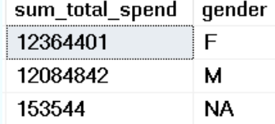
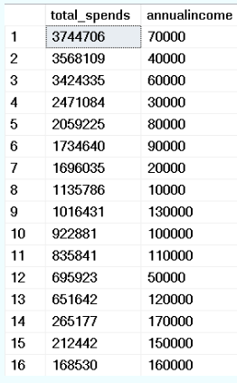
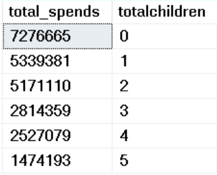
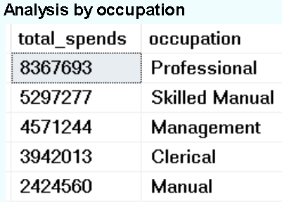
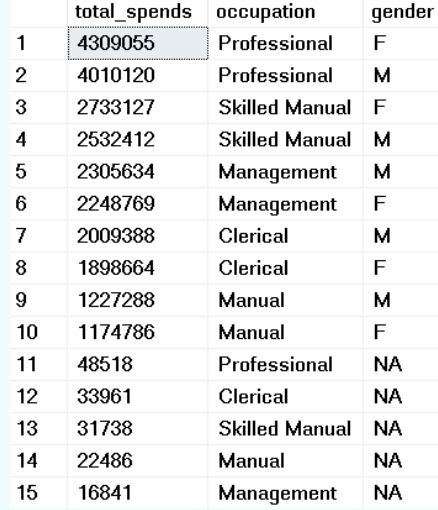
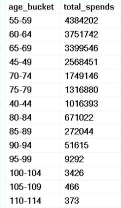

# 🧍‍♂️ Customer Analysis

### 🎯 Aims  
Analyze customer patterns in spending based on demographics (age, gender, occupation, number of children, home ownership, etc.) and regional distribution.

---

## 💸 Total Spend by Gender  

```sql
WITH agg_cust AS (
  SELECT 
    ROUND(SUM(productprice), 0) AS total_spend,
    CustomerKey,
    SUM(orderquantity) AS total_products_bought,
    gender,
    annualincome,
    totalchildren,
    occupation,
    age,
    SalesTerritoryKey,
    Region,
    Country,
    Continent
  FROM sales_analysis
  GROUP BY CustomerKey, gender, annualincome, totalchildren, occupation, age,
           SalesTerritoryKey, Region, Country, Continent
)
SELECT 
  SUM(total_spend) AS sum_total_spend,
  gender
FROM agg_cust
GROUP BY gender;
```

  
💡 **Insight:** Male/female spend is fairly equal, with women spending slightly more on average.  
✅ **Recommendation:** Consider segmenting marketing equally between genders, with slight emphasis on female preferences.

---

## 👪 Customers by Gender Count  

  
💡 **Insight:** Slightly fewer female customers—but they spend more on average than men.  
✅ **Recommendation:** Consider campaigns to increase female customer acquisition.

---

## 💰 Revenue by Annual Salary Buckets  

```sql
SELECT 
  SUM(total_spend) AS total_spends,
  annualincome
FROM agg_cust
GROUP BY annualincome
ORDER BY total_spends DESC;
```

  
💡 **Insight:** Most revenue comes from lower salary brackets—possibly due to higher customer count in those brackets.  
✅ **Recommendation:** Investigate customer count by income level to confirm. Consider pricing strategies tailored to this group.

---

## 🧒 Revenue by Number of Children  

```sql
SELECT 
  SUM(total_spend) AS total_spends,
  totalchildren
FROM agg_cust
GROUP BY totalchildren
ORDER BY total_spends DESC;
```

  
💡 **Insight:** Strong negative correlation between number of children and spend (–0.975).  
✅ **Recommendation:** Prioritize targeting customers with fewer or no children.

---

## 👷 Revenue by Occupation  

```sql
SELECT 
  SUM(total_spend) AS total_spends,
  occupation
FROM agg_cust
GROUP BY occupation
ORDER BY total_spends DESC;
```

  
💡 **Insight:** Professionals, skilled manual workers, and managers spend the most.  
✅ **Recommendation:** Focus marketing efforts on these occupation groups.

---

## 👩‍💼 Revenue by Occupation and Gender  

  
💡 **Insight:** The same high-spending occupation trend holds for both genders.  
✅ **Recommendation:** Segment by occupation first, then refine by gender if needed.

---

## 👵 Revenue by Age Buckets  

```sql
WITH agg_cust AS (
  SELECT 
    ROUND(SUM(productprice), 0) AS total_spend,
    CustomerKey,
    SUM(orderquantity) AS total_products_bought,
    gender,
    annualincome,
    totalchildren,
    occupation,
    age,
    SalesTerritoryKey,
    Region,
    Country,
    Continent
  FROM sales_analysis
  GROUP BY CustomerKey, gender, annualincome, totalchildren, occupation, age,
           SalesTerritoryKey, Region, Country, Continent
)
SELECT 
  CAST((age / 5) * 5 AS VARCHAR) + '-' + CAST((age / 5) * 5 + 4 AS VARCHAR) AS age_bucket,
  SUM(total_spend) AS total_spends
FROM agg_cust
GROUP BY (age / 5) * 5
ORDER BY total_spends DESC;
```

  
💡 **Insight:** Age range 45–69 are the top spenders. Some unrealistic ages (e.g. 110+) suggest data isn't fully clean.  
✅ **Recommendation:** Focus campaigns on 45–69 group. Clean and validate outlier age data.
