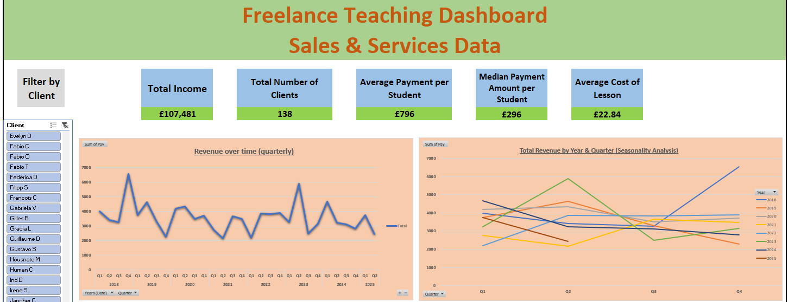
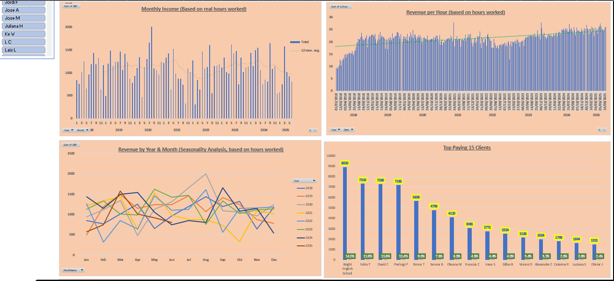
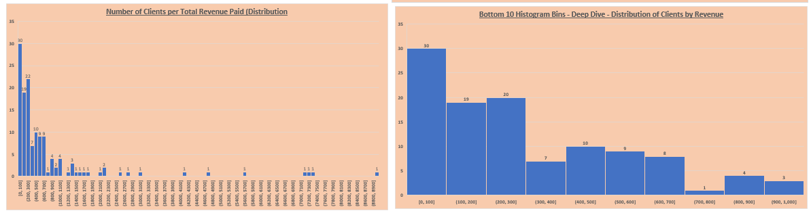

# Excel Dashboard of Freelance Sales & Services Data

## 📊 Executive Summary

This project presents an Excel dashboard analysing data from my own freelance English teaching and language coaching business, covering a period from January 2018 to 2025. The dashboard was built to track revenue trends, client behavior, and productivity metrics, with the aim of generating actionable insights to support better decision-making.

---

## 📁 Datasets Used

1. **Students_Payments**
   - Description: Records all payments made by students
   - Size: 1,336 rows × 10 columns (Date, Name, Amount, etc.)
   - Period: Jan 2018 – Aug 2025

2. **Weekly_Earnings**
   - Description: Tracks total hours worked and equivalent revenue
   - Size: 354 rows × 15 columns (Date, Hours, GBP earned, etc.)
   - Period: Jan 2018 – Aug 2025

---

## 🧠 Methodology

- Cleaned and validated data across two datasets
- Used pivot tables to aggregate data by month, quarter, and client
- Created KPIs to track revenue per hour, total revenue, and active clients
- Built interactive visualizations including histograms, line charts, and bar charts
- Added slicers for client-level analysis
- Focused on presenting a single-page dashboard for clarity and usability

---

## 📈 Dashboard Preview

The dashboard layout includes:
- Key performance indicators (KPIs)
- Slicer to filter by individual client
- 8 charts covering revenue trends, client distribution, and productivity

  
  

---

## 🧾 Key Insights

- **Revenue Trend**: Overall revenue decreased over time, falling from ~£4,000 to ~£3,000 per quarter.
- **Quarterly Performance**: Q4 consistently underperforms; Q2 shows the most variation.
- **Revenue Per Hour**: Despite falling total revenue, earnings per hour have increased, especially in the last year.
- **Client Concentration**: The top 15 clients (of 138) account for 86% of total revenue.
- **Churn and Engagement**: Most clients drop off quickly; over 50% of them spent less than £400 in total.

---

## ✅ Recommended Actions

- **Retention Strategy**: Investigate why most clients leave quickly. Consider surveying them to gather feedback and address barriers to continued engagement.
- **Client Value Focus**: Develop strategies to retain and upsell the ~15 high-value clients.
- **Lead Generation**: Invest time in reaching new clients, as total revenue is declining even while efficiency improves.

---

## 🧭 What I Learned

- How to structure and communicate data insights through a professional dashboard
- The value of combining client-level analysis with revenue and productivity KPIs
- The importance of balancing total workload vs. effective pricing strategies

---

## 💻 Tools Used

- Microsoft Excel
  - PivotTables
  - Charts (line, bar, histogram)
  - Slicers
  - Lookup functions
  - Conditional Formatting

---

## 📂 How to Explore This Project

1. Open `ExcelDashboard_Final.xlsx` to interact with the full dashboard.
2. View the screenshots above for a quick overview.
3. Raw data is available in the `/data` folder.
4. All insights and actions are summarized in this README.

---

## 📫 Contact

Feel free to reach out with questions, collaborations, or feedback:  
**[Your Name]** – [LinkedIn Profile or Email]

