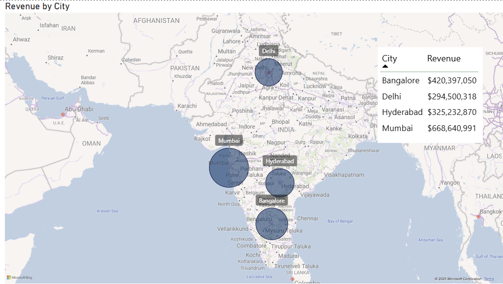

# Hotel Chain Sales Dashboard – Power BI Project

## 📊 Project Overview
This project investigates **why hotel booking revenue dropped in July 2025** using Power BI.  
The analysis covers trends over time, by city, booking platform, hotel classes, and number of guests.  
A second page drills into weekly patterns and booking behaviors.

---

## 🗂 Data Preparation
- Imported and profiled multiple tables with **Power Query**  
  - Standardized column names  
  - Added date attributes (Start of Week, Start of Month, Day Type)  
  - Created calculated fields: days between booking & check-in, scheduled_days  
- Built a star schema data model:  
  - **Fact tables:** Bookings, Agg_Bookings  
  - **Dimension tables:** Date, Hotels, Rooms  
- Created a dedicated **Measures Table** with DAX KPIs:  
  - Revenue, Total Bookings, Cancellation %, No Show %, Realisation %, Avg/Median Days to Check-in, Occupancy  

---

## 📈 Dashboards

### Revenue Overview
- Revenue by Month, City, Room Class, Booking Platform, and Number of Guests  
- Key metrics: Total Revenue ($1.7B), Total Bookings (135K), Cancellation % (25%)

---

### Geographic Breakdown
- Revenue by City shown on an interactive map  
- Highlights Mumbai and Bangalore as the biggest markets

---

### Deeper Analysis
- Weekly revenue for June–July to explore July drop-off  
- Avg & Median Days between Booking and Check-in  
- Breakdown by Room Class and Number of Guests  
- Hotel-level revenue (e.g. Atliq Exotica -26M in July)

---

### Data Model
- Star schema with dimension and fact tables  
- Relationships between booking, hotel, room, and date tables  
- Measures table for DAX calculations

---

## 🔎 Findings
- **Revenue trend:**  
  - May peak $573M → June $565M → July $499M (-$65M drop)  
  - Last week of July dropped to ~$20M, vs usual $40–60M/week  

- **Segment breakdown:**  
  - **Cities:** Mumbai (-$25M) and Bangalore (-$18M) hardest hit  
  - **Room Class:** Elite/RT2 in particular fell ~-$22M  
  - **Guests:** 2-guest bookings in particular declined -$31M  
  - **Platforms:** “Others” category fell ~-$25M  
  - **Hotels:** Atliq Exotica -$26M, Atliq Bay -$14M, Atliq Blu -$12M  

- **Operational metrics:**  
  - Realisation % improved MoM  
  - Cancellation % and No Shows declined  
  - Avg booking lead time shrank from **10 days in April → 3 days in July**  

---

## ✅ Conclusions
- The July 2025 revenue decline was **broad-based across all cities, platforms, room classes, and guest segments**.  
- Operational performance improved, so the drop is **not due to cancellations or no-shows**.  
- Biggest impact areas: Mumbai & Bangalore, RT2 premium rooms, 2-guest bookings, and Atliq Exotica hotels.

---

## 💡 Recommendations
1. **Seasonality review** – assess if June–July is a seasonal low in India.  
2. **Marketing audit** – check for reduced campaigns or competitor promotions.  
3. **Reputation analysis** – review customer feedback & media for negative publicity.  
4. **Competitive benchmarking** – identify if rivals aggressively expanded or discounted in these months.  

---

## 🛠 Tools Used
- **Power BI Desktop**  
- **Power Query** for ETL  
- **DAX** for calculated measures  
- **Map visuals, tables, KPIs, and slicers** for analysis  

---

