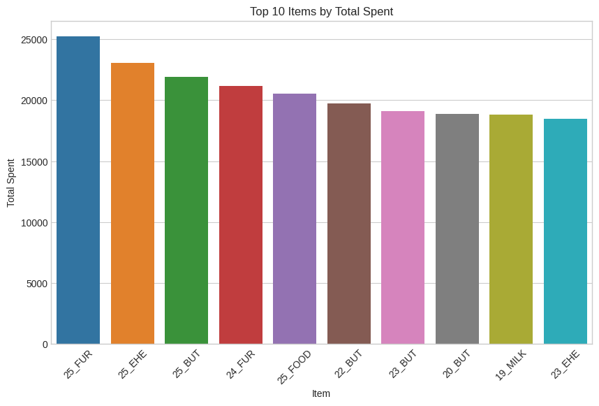
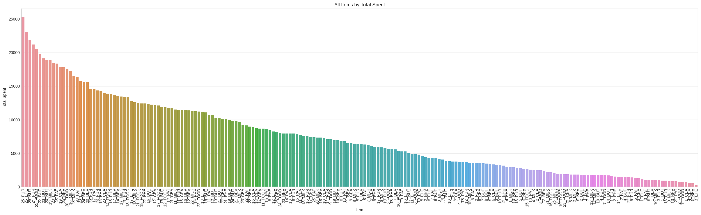
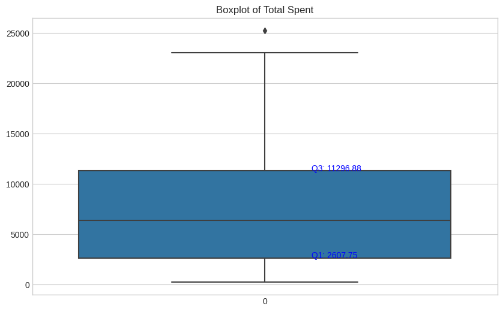
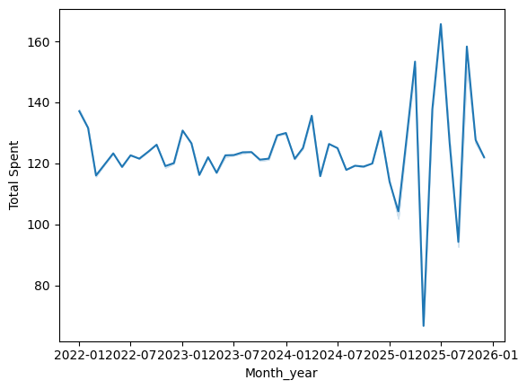

# Python - Retail Sales Analysis EDA

## 📁 Dataset  
**[Retail Store Sales (Dirty) for Data Cleaning — Kaggle](https://www.kaggle.com/datasets/ahmedmohamed2003/retail-store-sales-dirty-for-data-cleaning)**

---

## ✅ Objective  
This project focuses on exploring and cleaning a messy retail sales dataset, followed by analysis and visualization to uncover insights into customer behavior, revenue trends, and category performance.

---

## ⚙️ Tools Used  
- Python 3  
- Pandas  
- Seaborn  
- Matplotlib  

---

## 1. Load & Describe Dataset

```python
import pandas as pd

df = pd.read_csv("retail_store_sales.csv")
df.info()
df.describe(include='all')
df.head()
df.tail()
```

**Observations:**
- 12,575 rows, 11 columns  
- Object and float datatypes  
- 8 product categories, 200 items, 3 payment methods  

---

## 2. Null Value Inspection

```python
df.isnull().sum()
round(df.isnull().sum()/len(df)*100, 2)
```

| Column            | % Nulls |
|------------------|---------|
| Item             | 9.65%   |
| Price Per Unit   | 4.84%   |
| Quantity         | 4.80%   |
| Total Spent      | 4.80%   |
| Discount Applied | 33.39%  |

---

## 3. Data Cleaning

### Convert IDs

```python
df['Transaction ID'] = df['Transaction ID'].str.replace('TXN_', '').astype(int)
df['Customer ID'] = df['Customer ID'].str.replace('CUST_', '').astype(int)
```

### Format Strings

```python
df['Category'] = df['Category'].str.lower()
df['Item'] = df['Item'].str.replace('Item_', '')
df['Payment Method'] = df['Payment Method'].str.lower()
df['Location'] = df['Location'].str.lower()
```

### Fill Missing Values

```python
df['Price Per Unit'].fillna(df['Price Per Unit'].median(), inplace=True)
df['Quantity'].fillna(0, inplace=True)
df['Total Spent'].fillna(0, inplace=True)
df['Discount Applied'].fillna('Unknown', inplace=True)
```

### Date Conversion

```python
df['Transaction Date'] = pd.to_datetime(df['Transaction Date'])
```

---

## 4. Analysis

### Revenue & Quantity by Category

```python
df.groupby('Category')['Total Spent'].sum().sort_values(ascending=False)
df.groupby('Category')['Quantity'].sum().sort_values(ascending=False)
```

### Customer Spend & Quantity

```python
df.groupby('Customer ID')['Total Spent'].sum().sort_values(ascending=False)
df.groupby('Customer ID')['Quantity'].sum().sort_values(ascending=False)
```

### Payment & Discount Impact

```python
df.groupby('Payment Method')['Total Spent'].sum()
df.groupby('Discount Applied')['Total Spent'].sum()
```

---

## 5. Visualizations

### 🌟 Top 10 Items by Spend

```python
A1 = df.groupby('Item')['Total Spent'].sum().reset_index().sort_values(by='Total Spent', ascending=False).head(10)
sns.barplot(data=A1, x='Item', y='Total Spent')
```



### 📊 All Items by Spend

```python
A2 = df.groupby('Item')['Total Spent'].sum().reset_index().sort_values(by='Total Spent', ascending=False)
sns.barplot(data=A2, x='Item', y='Total Spent')
```



### 📦 Boxplot with Quartiles

```python
sns.boxplot(data=A2['Total Spent'])
```



---

## 6. Time-Based Trend Analysis

### Feature Engineering

```python
df['Year'] = df['Transaction Date'].dt.year.astype(str)
df['Month'] = df['Transaction Date'].dt.month.astype(str)
df['Month_year'] = pd.to_datetime(df['Month'] + '-' + df['Year'])
```

### Monthly Total Spend Over Time

```python
sns.lineplot(data=df, x='Month_year', y='Total Spent')
```



### Monthly Spend per Category

```python
sns.lineplot(data=df, x='Month_year', y='Total Spent', hue='Category')
```


---

## 7. Conclusion & Insights

- **Electronics** and **butchers** drive the most revenue  
- **Furniture** leads in quantity sold  
- **Online** slightly ahead of **in-store** in sales volume  
- Discount usage is balanced; marginal impact on revenue  
- Final quarter of the year shows largest fluctuations  

---

## 8. Future Opportunities

- Model customer segment behavior  
- Predict spend based on quantity and category  
- Visual dashboards in Power BI or Tableau  

---

## 9. Acknowledgements

Dataset from [Kaggle Retail Store Sales Dirty](https://www.kaggle.com/datasets/ahmedmohamed2003/retail-store-sales-dirty-for-data-cleaning)

---

_All code, cleaning steps, and plots prepared in Python (Pandas, Seaborn, Matplotlib). Plots are stored in the `/Images/` subdirectory._

